# Overview

## Ideal Viewing Dimension
__Desktop:__ 1400px

__Mobile:__ 400px

## The Concept
In the past, as a precaution in the COVID-19 pandemic, Japan has restricted the entry of travellers to those who have booked an itinerary through a travel agency only. As a result, there is less flexibility with personal travel My proposal for the website is to act as an itinerary generator, where users input their details and preferences to create a personalised itinerary. This reduces time spent on research and is a cost effective way of planning compared to going to a travel agency. The benefit for the government is that they can still monitor the number of tourists and where they are going. In the case that monitoring is no longer needed, it can become a quick and easy tool for everyone to use. Planning trips to a foreign country can often be intimidating, but with a government supported tool such as my proposal, more people may feel that there is less of a barrier for their travels.


## Sitemap
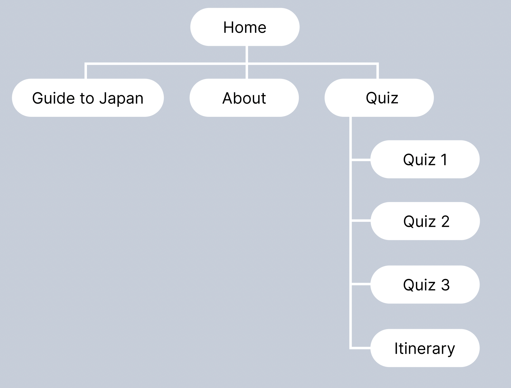
This website consists of __four__ sections:
* Home page
* About page
* Guide to Japan page
* Quiz section
	* Quiz page 1
  * Quiz page 2
  * Quiz page 3
  * Itinerary page

# The Prototype
## Home Page
### Desktop
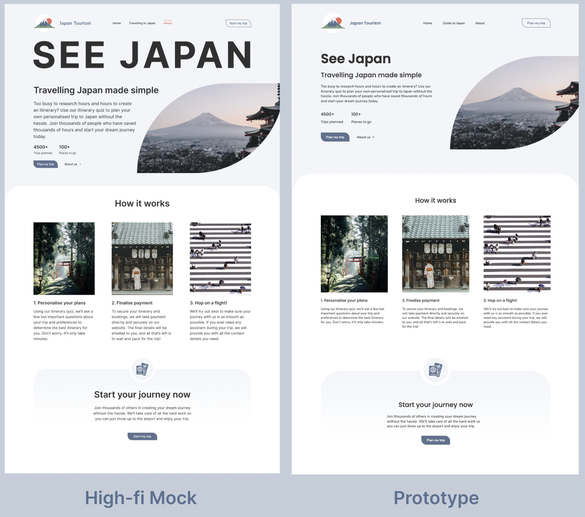

#### Design Changes
Most of the elements designed stayed the same between my mockup and prototype and I tried to mimic my original design to the best of my abilit. The only major change was to the major heading in the hero which says "See Japan". I received feedback from Jun (who marked my mockup assessment) saying that: 
>the bold statement 'SEE JAPAN' could be a little overwhelming for users. Perhaps you could include it in the same container as 'Travelling Japan made simple' and similar play around with font weights to achieve the same text hierarchy and effect without having the text too big on the screen.

I completely agree with this so in my final prototype I made adjustments to the placement to create a less jarring experience. This change also fits the design of the website aesthetically, as the rest of the website does not contain particularly bold elements.

I also made sure to make the wording of the call to action button in the nav bar, hero, and bottom section consistent, as before I had used two different wordings: "Start my trip" and "Plan my trip". This creates a more cohesive design.

#### Coding Process
Most of this page was straightforward to code. Mostly flex boxes were used as I realised that this allowed me to stack elements vertically for the mobile view by using:

```CSS
flex-direction: column;
``` 

For the bottom call to action section that says "Start your journey now", I used
```CSS
position: absolute;
```
for the icon at the top.

### Mobile
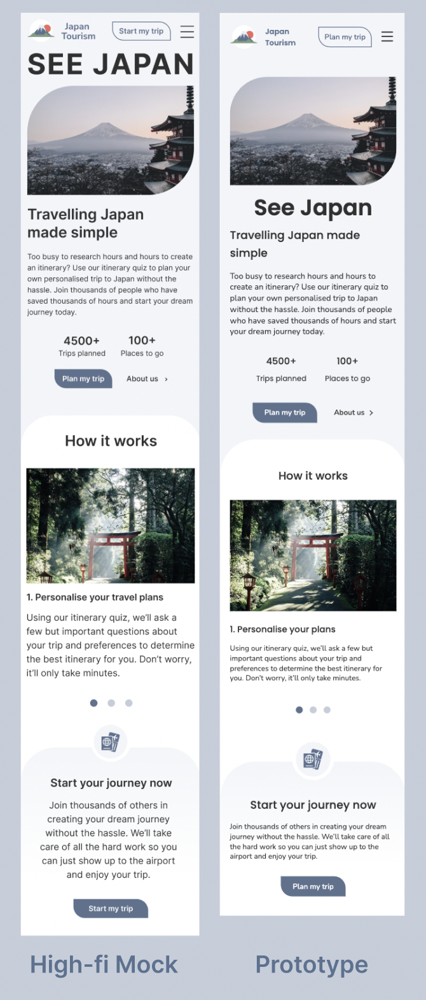

#### Design Changes
The design of the mobile view stayed mostly the same. I changed some font sizes and text alignment to make the page more consistent.

#### Coding Process
I started with a desktop first approach to my code so the mobile / tablet breakpoint was added afterwards.


The main challenge I encountered was implementing the slideshow function for the "How it Works" section. I adapted the scaffold from [w3 schools](https://www.w3schools.com/howto/howto_js_slideshow.asp) and used css and JavaScript. It took some trial and error to make sure that it only showed the slideshow view when it was at the mobile breakpoint.

Ideally I would have liked to add a transition between the slides, and it would be something to consider for next time I tried to implement something similar.

## Guide to Japan Page
### Desktop
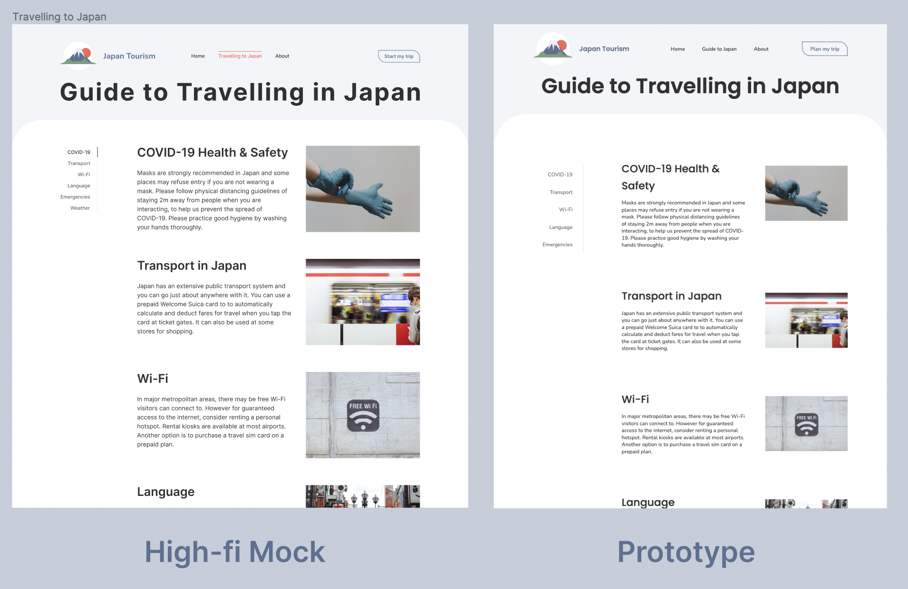

#### Design Changes
There were no major changes on this page. I did add more padding and spacing between each topic so that it was less condensed.

I also changed the wording of the link navigating to this page from "Travelling to Japan" to "Guide to Japan". This was after feedback that pointed out that the former may be unclear for the user as to what the page means, so I clarified this in the prototype wording.

#### Coding Process
One problem I had with coding this page was the sticky side bar. It would not stick when the parent was a flex box. After some fiddling around and researching on the internet, I found out that this is because flex box elements are default set to stretch [(bholtbolt, 2017)](https://stackoverflow.com/questions/44446671/my-position-sticky-element-isnt-sticky-when-using-flexbox) so I had to use

```CSS
align-items: flex-start;
```

to fix this problem. 

### Mobile
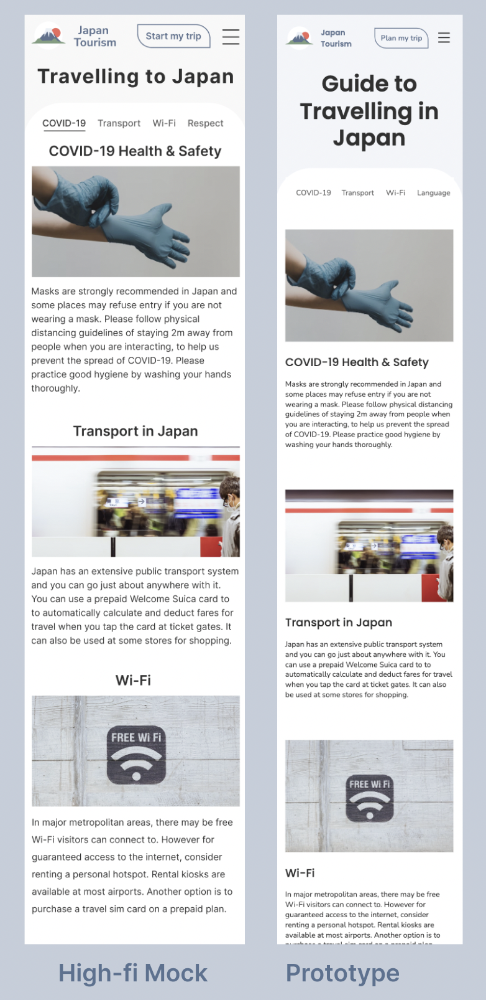

#### Coding Process
In my original mockup, I had the title of each section / information block above the image. However due to the way I structured it, this would not have been possible unless I created two title elements and hid the title element version on the mobile view, and show a separate mobile version for this breakpoint. I realised in hindsight now, that this might have been possible if I had used grids instead of a flexbox, as then the boundaries between the elements are less concrete, as I would not have to have the title and paragraph in one div together.

## About Page
### Desktop
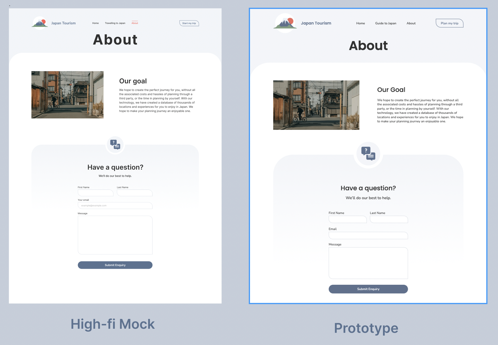

#### Design Changes
There were no major design changes to this page.

#### Coding Process
Styling this page was the most difficult process. I found out that form elements have a lot of inherent styling which I had to reset. For example by using inspect page, I realised that I had to reset the following property or the whole form was offset:

```CSS
padding-inline-start: 0;
```

### Mobile
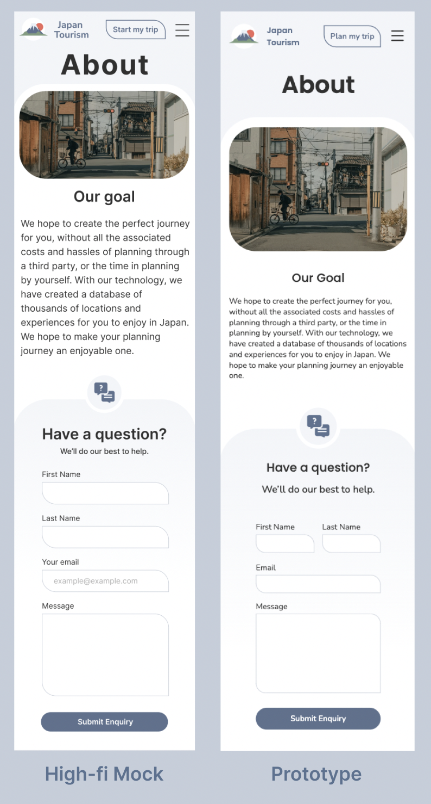

#### Design Changes
The one change to the mobile view was that originally I had the form input elements all stacked vertically. However when I actually prototyped this part, I realised that the name and last name could stay on one line as there was more space than I had anticipated. This also ensures that like form elements are grouped together and does not break the flow for the user.

## Quiz
### Desktop
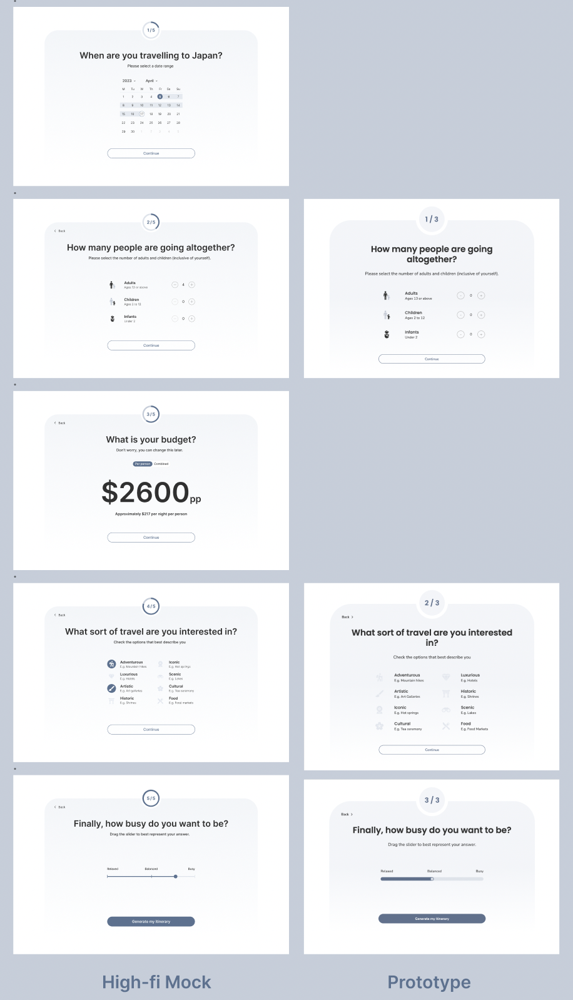

#### Design Changes
My original quiz was 5 pages long. However from feedback, I was suggested to reduce the scope. Although the orignal suggestion was to combine all pages into one scrollable form, I thought that this defeated the point of the design of the form – it was designed to take up a whole page, to make the experience less overwhelming for the user. As such, I reduced the form length to 3 pages, choosing key questions. 

#### Coding Process
In creating the website, the form was the most difficult. For the first page where the user can select the number of adults, JavaScript was involved.

On the second page, I used the checkbox element so that it could actually be data written in a form submission. This was difficult to style as the checkbox itself could not be styled and instead, I had to change its opacity to 0, and change another div instead of the checkbox itself.

On the third page, I also ran into styling problems with the range slider. In the end, I found a solution on [stack overflow](https://stackoverflow.com/questions/28283332/style-lower-and-upper-fill-in-html5-range-input) which uses box-shadow to create a coloured upper track by using overflow: hidden. This however, meant that the thumb of the slider could not be the original design, so the final design is an inverted colour version.

I also removed the vertical bars that indicated the position of the description label, as the positioning of them would mean that it was behind the slider and it did not work practically. However I changed the slider range to have steps of 10, so that it would snap to an interval. This makes it easier for the user to put exactly where they want to, without overthinking the increments.

### Mobile
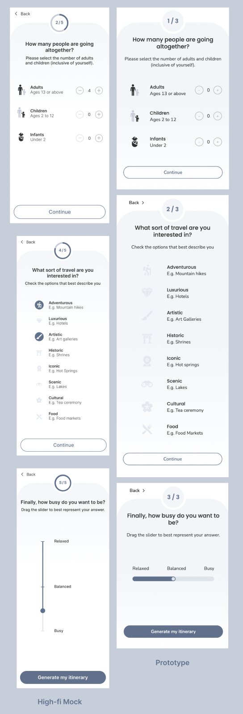

#### Design Changes
Instead of a vertical slider, I kept it horizontal as I realised that this would make more sense rather than dragging the thumb vertically.

#### Coding Process
The second quiz page where the user selects the activities they are interested in is formatted in a grid. I chose grid over flex as I realised that this would better suit the design as it could be more responsive.

## Itinerary
### Desktop
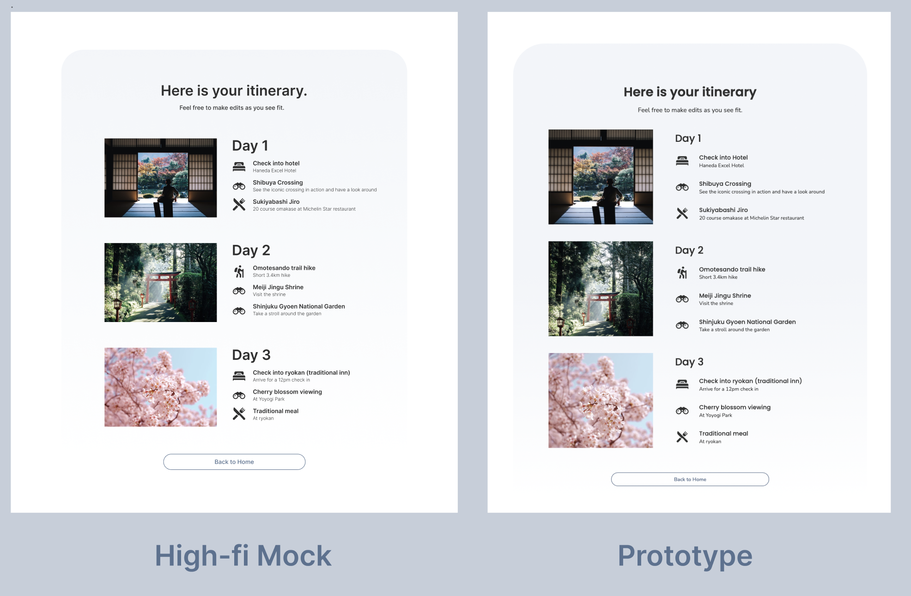

#### Design Changes
Overall there are few changes on this page apart from slightly different sizing and spacing. I added more space in between elements to reduce condensed clutter, and make it easier to read.

### Mobile
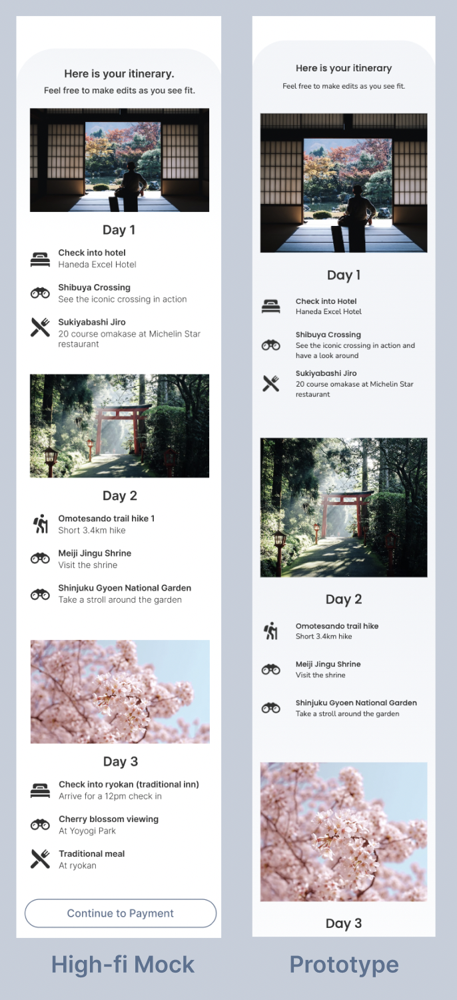

# References
AJ. (2018). Japanese cherry blossom sakura [Image]. Retrieved from https://unsplash.com/photos/McsNra2VRQQ 

Banks C. (2020). A slice of life [Image]. Retrieved from https://unsplash.com/photos/Q3DaZ8vmBAA

Banks C. (2020). Latex & Chill [Image]. Retrieved from https://unsplash.com/photos/cEzMOp5FtV4

Cervantes A. (n.d.). Bed [Image]. Retrieved from https://www.flaticon.com/free-icon/bed_2460894

Cosentino M. (2018). Chureito Pagoda [Image]. Retrieved from https://unsplash.com/photos/n--CMLApjfI 

Cresnar G. (n.d.). Binoculars [Image]. Retrieved from https://www.flaticon.com/free-icon/binoculars_125767 

Flat Icons. (n.d.). Mount fuji [Image]. Retrieved from https://www.flaticon.com/free-icon/mount-fuji_670018 

Freepik. (n.d.). Baby [Image]. Retrieved from https://www.flaticon.com/free-icon/baby_3060808


Freepik. (n.d.). Cherry Blossom [Image]. Retrieved from https://www.flaticon.com/free-icon/cherry-blossom_1762812 

Freepik. (n.d.). Conversation [Image]. Retrieved from https://www.flaticon.com/free-icon/conversation_2068846 

Freepik. (n.d.). Landmark [Image]. Retrieved from https://www.flaticon.com/free-icon/landmark_1823637


Freepik. (n.d.). Monument [Image]. Retrieved from https://www.flaticon.com/free-icon/monument_4549829


Freepik. (n.d.). Paint Brush [Image]. Retrieved from https://www.flaticon.com/free-icon/paint-brush_587377 

Freepik. (n.d.). Passport [Image]. Retrieved from https://www.flaticon.com/free-icon/passport_620896 

Freepik. (n.d.). Restaurant [Image]. Retrieved from https://www.flaticon.com/free-icon/restaurant_685352 

Hanaoka P. (2019). Untitled. [Image]. Retrieved from https://unsplash.com/photos/KRAk_61pgTo


Inoue S. (2020). Untitled [Image]. Retrieved from https://unsplash.com/photos/kaoHI0iHJPM


Iwata R. (2017). walk walk walk [Image]. Retrieved from https://unsplash.com/photos/n31JPLu8_Pw


Japan National Tourism Organization. (n.d.) Japan Tourism Official Website. Retrieved from https://www.japan.travel/en/au/.


Jimenez C. (2019). Untitled [Image]. Retrieved from https://unsplash.com/photos/vGu08RYjO-s


Komori M. (2018). Untitled [Image]. Retrieved from https://unsplash.com/photos/qwPSnBvdhtI


Land and Climate of Japan. (n.d.). Retrieved from https://www.mlit.go.jp/river/basic_info/english/land.html


Oyodo N. (2021). Dotonbori shopping street [Image]. Retrieved from https://unsplash.com/photos/XPO6jJdQDAY 

Prettycons. (n.d.). Diamond [Image]. Retrieved from https://www.flaticon.com/free-icon/diamond_636499


Redd. (2017). Old ways in new days [Image]. Retrieved from https://unsplash.com/photos/Bxzrd0p6yOM


riajulislam. (n.d.). Hiking [Image]. Retrieved from https://www.flaticon.com/free-icon/hiking_8131040


Sudowoodo. (n.d.). Father and son [Image]. Retrieved from https://www.flaticon.com/free-icon/father-and-son_4605441 

Sze C. (2016). Man waits at Tokyo Station [Image]. Retrieved from https://unsplash.com/photos/ay8pWdlM5_o